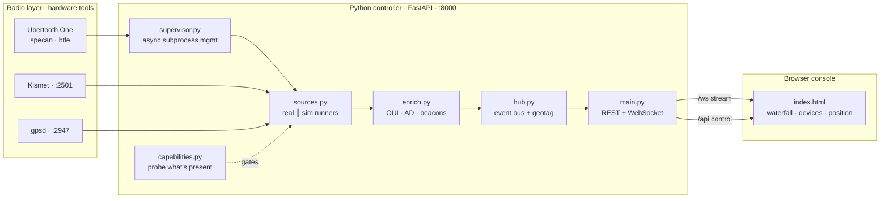

# BleedBlue

**Passive 2.4 GHz situational awareness for the Raspberry Pi.**

BleedBlue turns a Raspberry Pi 5 and an [Ubertooth One](https://greatscottgadgets.com/ubertoothone/)
into a self-contained, offline reconnaissance appliance for the 2.4 GHz band. It
watches the spectrum, discovers and *decodes* Bluetooth Low Energy advertisements,
enumerates Wi-Fi devices through Kismet, geotags everything against a GPS fix, and
serves it all to a browser console you reach over the Pi's own hotspot — no cloud,
no build step, no internet.

---

## Table of contents

- [Features](#features)
- [Architecture](#architecture)
- [Hardware](#hardware)
- [Installation](#installation)
- [Configuration](#configuration)
- [Running it](#running-it)
- [The event protocol](#the-event-protocol)
- [REST API](#rest-api)
- [Enrichment](#enrichment)
- [Demo mode](#demo-mode)
- [Project layout](#project-layout)
- [Extending: adding a source](#extending-adding-a-source)
- [Known limitations & hardware ceilings](#known-limitations--hardware-ceilings)
- [Legal & ethical use](#legal--ethical-use)

---

## Features

- **2.4 GHz spectrum analyzer** — a live sweep trace with **max-hold**, an estimated
  **noise floor**, and channel markers for Wi-Fi (1/6/11) and BLE advertising
  (37/38/39), over a scrolling waterfall. Non-hopping-carrier / interference
  detection runs server-side and raises alerts.
- **BLE discovery *and decode*** — not just addresses and RSSI, but parsed
  advertising payloads: device names, service UUIDs, TX power, flags, manufacturer
  data, and recognised **iBeacon** and **Eddystone** frames.
- **Vendor & address intelligence** — OUI → manufacturer lookup for BLE and Wi-Fi
  alike, plus BLE address-type classification (public vs. random-static /
  resolvable-private / non-resolvable-private).
- **Wi-Fi device engine** — Kismet enumeration of access points and clients, with
  SSIDs, signal, vendor, and AP↔client associations.
- **GPS geotagging** — position, altitude, speed, and **fix quality** (satellites
  in use, HDOP). The latest fix is stamped onto *every* event as it's published, so
  the whole system is spatial through one seam.
- **Runs fully offline** — the browser console is a single self-contained HTML file
  with no external dependencies and no build step. Serve it from the Pi; reach it
  over the Pi's hotspot.
- **Graceful degradation** — missing a radio? The affected source reports itself
  unavailable with a human-readable reason, and the rest of the system runs. On a
  laptop with no hardware at all, the console drops into a **demo simulator** that
  emits the exact same event shapes.

## Architecture

Four thin layers with a single bus between them. Radio tools are treated as
supervised subprocesses; their output is normalised, enriched, and fanned out over
one event hub to a WebSocket.



**Design principles**

- **Capability probing over assumption.** `capabilities.py` checks for
  `ubertooth-util`, Kismet (`:2501`), gpsd (`:2947`), and a monitor-mode Wi-Fi
  interface, and every source declares which it requires. Nothing starts blind.
- **Supervised subprocesses.** `supervisor.py` wraps each radio tool as an async
  process with line-streamed stdout and a clean `SIGTERM`-then-`SIGKILL` stop, so a
  wedged tool can't take the controller down.
- **A bounded, drop-oldest bus.** `hub.py` fans events out to every subscriber
  (each WebSocket client gets its own queue). Under load it drops the *oldest*
  events rather than blocking producers or growing without limit — a live monitor
  should stay live, not stall.
- **One event contract, two producers.** Every source implements `run_real()` and
  `run_sim()` that emit *identical* event shapes. The simulator isn't a mock bolted
  on the side; it's a first-class second producer, which is why the demo console is
  faithful to the real thing.

## Hardware

| Component | Role | Required? |
|---|---|---|
| Raspberry Pi 5 (64-bit, Pi OS Lite) | Host | **Yes** |
| Ubertooth One | 2.4 GHz spectrum + BLE | **Yes** for spectrum/BLE |
| USB GPS receiver (gpsd-compatible) | Geotagging + fix quality | Optional |
| Wi-Fi adapter with monitor mode + Kismet | Wi-Fi device engine | Optional |
| 2.4/5 GHz antenna + SMA pigtail | Range upgrade | Recommended |
| nRF52840 dongle + [Sniffle](https://github.com/nccgroup/Sniffle) | Second radio | Optional |

The single most impactful upgrade is the **second radio** (~£10): it removes the
one-Ubertooth contention between spectrum and BLE *and* gives you far better BLE
sniffing (connection following, all three advertising channels). The cheapest
upgrade is a **better antenna and a short SMA pigtail** to get it away from the Pi's
RF noise.

## Installation

BleedBlue targets **Raspberry Pi OS Lite (64-bit)** on a Pi 5, but the controller
and console run on any Linux/macOS machine for development.

```bash
# 1. system radio tools (on the Pi)
sudo apt update
sudo apt install -y ubertooth gpsd gpsd-clients kismet

# 2. the app
git clone <your-repo-url> bleedblue
cd bleedblue
python3 -m venv .venv && source .venv/bin/activate
pip install -r requirements.txt
```

Python dependencies are deliberately minimal — `fastapi` and `uvicorn`. Everything
else is standard library.

> **Field deployment.** The intended distribution model is a prepared SD-card image:
> the radio tools, a Python venv, and a systemd unit that brings the controller up
> on boot, with the Pi running as a Wi-Fi access point so you connect straight to
> the console. A reproducible setup script builds that image; running from source as
> above is the development path.

## Configuration

All configuration is environment variables — no config file to manage.

| Variable | Default | Effect |
|---|---|---|
| `APP_SIMULATE` | `1` | `1` lets sources fall back to the simulator when their hardware is absent. Set `0` for a field build: a missing radio then returns a hard `409` with its reason instead of synthetic data. |
| `OUI_FILE` | *(unset)* | Path to an IEEE `oui.txt` or a Wireshark `manuf` file. Loaded at startup to give full vendor coverage on top of the curated built-in table. Stays fully offline. |
| `KISMET_APIKEY` | *(unset)* | API key for Kismet device enumeration. Without it, the Kismet source will not authenticate. |

## Running it

```bash
# from the repo root
uvicorn app.main:app --host 0.0.0.0 --port 8000
```

Then open **http://localhost:8000** (or `http://<pi-hostname>:8000` from another
device on the Pi's network). The controller serves the console itself, so there's
nothing else to start.

In the console:

- Each radio has a **chip** — click to start/stop it. A green dot is live, amber is
  simulated, red is unavailable (with the reason on hover).
- The **spectrum** panel shows the analyzer trace over the waterfall; interference
  alerts flash in its header.
- **Devices seen** is the unified, enriched table across BLE and Wi-Fi.
- **Position** shows the current fix and its quality.
- **Log** carries state changes, warnings, and interference alerts.

## The event protocol

The WebSocket at `/ws` streams newline-free JSON objects. Every event has a `type`;
data events also carry `source`, a `sim` boolean, a `ts` timestamp, and — when a GPS
fix exists — `lat`/`lon` stamped on at emit time. On connect, the server sends a
`snapshot` first, then a live stream.

| `type` | Key fields | Meaning |
|---|---|---|
| `snapshot` | `sources[]` | Sent once on connect: the current source roster and state. |
| `spectrum` | `points[[freq,rssi]]`, `noise`, `peak[freq,rssi]` | One completed sweep, with the estimated noise floor and peak bin. |
| `ble` | `addr`, `rssi`, `vendor`, `addr_type`, `name?`, `services?`, `tx_power?`, `company?`, `beacon?` | A decoded BLE advertisement. |
| `device` | `mac`, `devtype`, `rssi`, `ssid?`, `vendor?`, `assoc?` | A Wi-Fi/Kismet device (AP or client). `assoc` is the AP a client is bound to. |
| `gps` | `kind:"fix"` → `lat,lon,alt,speed` · `kind:"quality"` → `sats_used,sats_seen,hdop` | Position, or fix quality. |
| `state` | `source`, `running`, `sim` | A source started or stopped. |
| `log` | `source`, `level`, `msg` | `info` / `warn` / `error` / `alert`. Interference detections arrive as `alert`. |

Because the contract is explicit and shared by the real and simulated producers,
you can develop against `/ws` entirely in demo mode and trust it will match hardware.

## REST API

| Method & path | Purpose |
|---|---|
| `GET /` | Serve the browser console. |
| `GET /api/capabilities` | What hardware/tools are present, with the gaps named. |
| `GET /api/status` | Per-source running state. |
| `POST /api/sources/{key}/start` | Start one source. `409` if unavailable and simulation is off. |
| `POST /api/sources/{key}/stop` | Stop one source. |
| `POST /api/sources/start_all` | Start everything that can run. |
| `POST /api/sources/stop_all` | Stop everything. |
| `WS /ws` | Live event stream (sends a `snapshot` first). |

Source keys: `spectrum`, `ble`, `gps`, `kismet`.

## Enrichment

`enrich.py` is where raw identifiers become meaning, and it's pure, hardware-free,
and unit-testable:

- **OUI → vendor.** A curated table of common prefixes (Apple, Espressif, Raspberry
  Pi, Google, Samsung, TI, Ubiquiti, …) ships built in; point `OUI_FILE` at the full
  IEEE registry for exhaustive coverage. Unknown prefixes return *nothing* rather
  than a wrong guess.
- **BLE address classification.** Distinguishes public (real OUI) addresses from
  random ones, and among random, the static / resolvable-private / non-resolvable
  sub-types — using the address bits, with the usual caveat that the definitive
  signal is the BLE `TxAdd` bit.
- **Advertising-data decode.** Walks the length-type-value AD structures into names,
  16/32/128-bit service UUIDs, TX power, flags, and manufacturer-specific data, and
  recognises **iBeacon** (UUID / major / minor / TX) and **Eddystone** frame types.
- **Company IDs.** Bluetooth SIG company identifiers from manufacturer data resolve
  to names (Apple, Microsoft, Google, Nordic, …).

## Demo mode

If the console can't reach a backend within a couple of seconds, it switches to an
**amber demo mode** and runs a built-in simulator in the browser. The simulator
produces the same event shapes as the backend — decoded iBeacons and Eddystone
beacons, vendor-resolved Wi-Fi clients associated to APs, a fluctuating spectrum
with a periodically injected non-hopping carrier that trips the interference
detector, and a drifting GPS fix with quality. It exists so the interface can be
built, demonstrated, and reviewed on any laptop, and so a field unit degrades
legibly instead of going blank.

The backend has its own simulator too (the `run_sim()` on each source), gated by
`APP_SIMULATE`, for developing the controller without radios attached.

## Project layout

```
bleedblue/
├── app/
│   ├── main.py          FastAPI app: serves the console, REST + WebSocket, lifespan
│   ├── capabilities.py  probes for ubertooth / kismet / gpsd / monitor-mode Wi-Fi
│   ├── supervisor.py    async subprocess wrapper (line-streamed, clean shutdown)
│   ├── hub.py           bounded drop-oldest event bus; holds last fix, geotags events
│   ├── sources.py       Spectrum / BLE / GPS / Kismet sources (real + sim runners)
│   └── enrich.py        OUI, address classification, BLE AD + beacon decoding
├── frontend/
│   └── index.html       self-contained operator console (no build step)
├── requirements.txt
└── README.md
```

## Extending: adding a source

A source is a small class declaring the hardware it needs and providing two runners.
The base class handles start/stop, the sim/real switch, error capture, and state
events; you write the two runners and emit events.

```python
from capabilities import Req
from sources import Source, SOURCES

class MySource(Source):
    key = "mysource"
    title = "My sensor"
    requires = Req.UBERTOOTH        # or GPSD / KISMET / WIFI_MONITOR / NONE
    event_type = "device"           # which protocol event this emits

    async def run_real(self):
        # drive the real tool; call self.emit(...) with your fields
        ...

    async def run_sim(self):
        # emit the SAME shape with synthetic data while self.running
        ...

SOURCES.append(MySource)
```

Emit with `self.emit(**fields)`; the hub adds `type`, `source`, `sim`, `ts`, and the
geotag automatically. Keep `run_sim()` faithful — it's what the demo console shows.

## Known limitations & hardware ceilings

Honesty about what this can't do is part of the design:

- **Real-hardware parsers are marked `VERIFY`.** The exact text output of
  `ubertooth-*` and the Kismet JSON schema shift between versions. Those parsing
  paths are written defensively but should be confirmed against your actual device;
  all enrichment, analysis, and UI logic is tested independently of hardware.
- **One Ubertooth can't do two jobs at once.** Spectrum sweeping and BLE sniffing
  both want the single radio. There is currently no mutual-exclusion guard, so on
  real hardware, run one at a time (or add a second radio).
- **BLE crypto.** `crackle` only defeats *legacy* BLE pairing; it does nothing
  against LE Secure Connections. Modern pairings are not recoverable here.
- **Bluetooth Classic.** A single half-duplex Ubertooth cannot reliably follow full
  Bluetooth Classic frequency hopping. BLE is the practical target.
- **No persistence yet.** BleedBlue is currently a *monitor* — it shows the present
  and forgets it. There is no recording or replay (see the roadmap).
- **No authentication yet.** Anyone on the Pi's network can reach the API and
  WebSocket. Don't expose it beyond a trusted local network until auth lands.

## Legal & ethical use

BleedBlue observes radio signals that are, by their nature, being broadcast. It is
built to be **passive**: it does not transmit, jam, deauthenticate, or inject, and
it makes no attempt to defeat modern encryption. Even so, the laws governing the
**interception and recording** of wireless communications — and the handling of any
personal data those signals reveal — vary widely by jurisdiction and can be strict.

You are responsible for operating this tool lawfully where you are. Use it on
spectrum and devices you own or are authorised to assess, respect others' privacy,
and understand your local regulations before you record anything.
